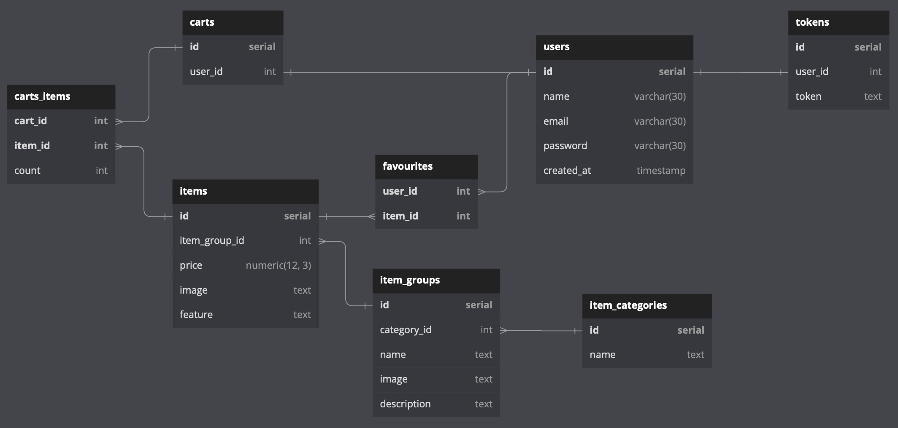

## Backend for web-shop 'Masterium' (ITMO project)

---

Launch:
make build && make run

Stop:
make stop

---

API:

Get all item groups: 
GET /api/item_groups
  
Get item group by id: 
GET item_groups/\<id\>
  
Get items by item group id: 
GET item_groups/\<id\>/items
  
Get all items: 
GET /items
  
Get item by id: 
GET /items/\<id\>

---

Database schema

Todo:
- Authorization
- Carts

Remarks:
Tried to use a clean architechture